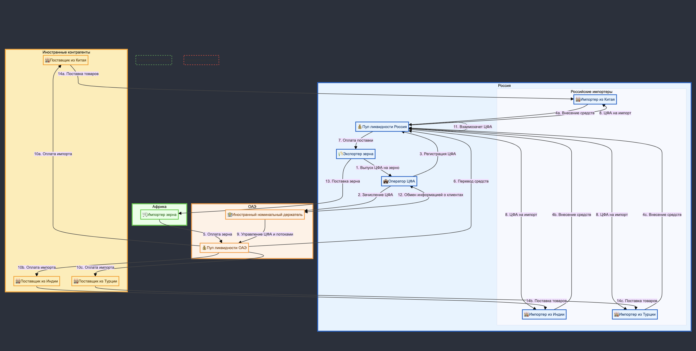

# Система трансграничного обмена цифровыми финансовыми активами (ЦФА)

## 1. Введение

Данная система представляет собой инновационный подход к международной торговле, использующий цифровые финансовые активы (ЦФА) для оптимизации трансграничных операций. Система объединяет участников из различных юрисдикций, обеспечивая эффективный механизм расчетов и обмена товарами.

## 2. Участники системы

### 2.1 Российская Федерация
- **Экспортер зерна**: Компания, производящая и экспортирующая зерно.
- **Оператор ЦФА**: Организация, ответственная за выпуск и управление ЦФА.
- **Пул ликвидности России**: Централизованный финансовый механизм для обеспечения расчетов внутри России.
- **Российские импортеры**: Компании, импортирующие товары из Китая, Индии и Турции.

### 2.2 ОАЭ
- **Иностранный номинальный держатель**: Организация, управляющая ЦФА и финансовыми потоками на международном уровне.
- **Пул ликвидности ОАЭ**: Централизованный финансовый механизм для международных расчетов.

### 2.3 Африка
- **Импортер зерна**: Компания, закупающая зерно у российского экспортера.

### 2.4 Иностранные контрагенты
- **Поставщики из Китая, Индии и Турции**: Компании, экспортирующие товары российским импортерам.

## 3. Ключевые процессы

### 3.1 Экспортный поток
1. Выпуск ЦФА на зерно российским экспортером через Оператора ЦФА.
2. Зачисление ЦФА иностранному номинальному держателю.
3. Регистрация ЦФА в пуле ликвидности России.
4. Оплата зерна африканским импортером через пул ликвидности ОАЭ.
5. Перевод средств из пула ликвидности ОАЭ в пул ликвидности России.
6. Оплата поставки экспортеру зерна из пула ликвидности России.
7. Физическая поставка зерна от российского экспортера африканскому импортеру.

### 3.2 Импортный поток
1. Внесение средств российскими импортерами в пул ликвидности России.
2. Выпуск ЦФА на импорт российским импортерам.
3. Оплата импорта иностранным поставщикам через пул ликвидности ОАЭ.
4. Поставка товаров от иностранных поставщиков российским импортерам.

### 3.3 Общие процессы
- Управление ЦФА и финансовыми потоками иностранным номинальным держателем.
- Взаимозачет ЦФА внутри пула ликвидности России.
- Обмен информацией о клиентах между Оператором ЦФА и иностранным номинальным держателем.

## 4. Особенности и преимущества системы

### 4.1 Использование ЦФА
- ЦФА выступают в качестве цифрового представления товаров и прав на них.
- Обеспечивают прозрачность и скорость трансграничных операций.
- Позволяют эффективно управлять рисками и ликвидностью.

### 4.2 Пулы ликвидности
- Обеспечивают централизованный механизм расчетов.
- Позволяют оптимизировать финансовые потоки и снизить транзакционные издержки.
- Способствуют балансировке экспортных и импортных операций.

### 4.3 Международное взаимодействие
- Система объединяет участников из разных юрисдикций (Россия, ОАЭ, Африка, Китай, Индия, Турция).
- Обеспечивает эффективный механизм для многосторонней торговли.
- Позволяет преодолеть ограничения традиционных финансовых систем.

### 4.4 Оптимизация торговых потоков
- Объединение экспортных и импортных операций в единую систему.
- Возможность проведения взаимозачетов и оптимизации финансовых потоков.
- Снижение зависимости от традиционных банковских систем и валют.

## 5. Технические аспекты

### 5.1 Блокчейн и смарт-контракты
- Использование технологии распределенного реестра для обеспечения прозрачности и безопасности операций.
- Применение смарт-контрактов для автоматизации процессов выпуска, передачи и погашения ЦФА.

### 5.2 Интеграция с существующими системами
- Взаимодействие с традиционными банковскими системами для ввода и вывода фиатных средств.
- Интеграция с системами учета и ERP участников для автоматизации бизнес-процессов.

### 5.3 Безопасность и соответствие требованиям
- Реализация мер по защите информации и операционной надежности.
- Соблюдение требований регуляторов разных стран, включая правила KYC и AML.

## 6. Перспективы развития

### 6.1 Расширение географии
- Включение новых стран и регионов в систему трансграничного обмена ЦФА.
- Адаптация системы к различным регуляторным требованиям.

### 6.2 Новые виды ЦФА
- Разработка ЦФА для различных видов товаров и услуг.
- Создание производных финансовых инструментов на базе ЦФА.

### 6.3 Развитие экосистемы
- Привлечение новых участников: банков, страховых компаний, логистических операторов.
- Создание дополнительных сервисов на базе платформы (например, торговое финансирование, хеджирование рисков).

## 7. Заключение

Представленная система трансграничного обмена ЦФА предлагает инновационное решение для оптимизации международной торговли. Объединяя преимущества цифровых технологий с потребностями реального сектора экономики, система создает новые возможности для эффективного взаимодействия участников из разных стран, способствуя развитию глобальной торговли и финансовой интеграции.