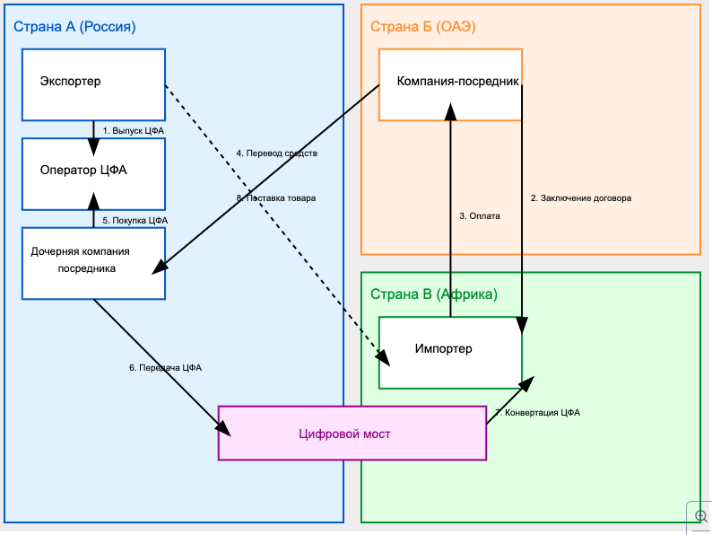
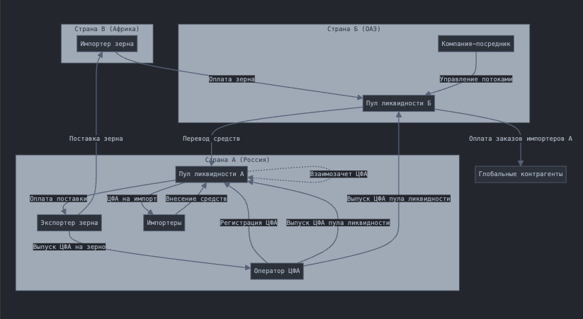

## Модель международных расчетов с использованием ЦФА 

### Этап 1: Базовая модель международных расчетов

#### Участники:

- **Экспортер (Россия)**: производитель товаров (например, зерно, металл)
- **Наша компания**: зарегистрированный оператор ЦФА в России
- **Компания-посредник** (например, ОАЭ): международный фасилитатор сделок
- **Импортер** (например, любая страна): конечный покупатель товара

### Процесс:

1. **Выпуск ЦФА**:
   - Экспортер через нашу компанию выпускает ЦФА на годовой объем своего товара

2. **Подготовка к сделке**:
   - Компания-посредник открывает дочернюю компанию в России (этого можно избежать, но пока закон говори, что есть только такой метод)

3. **Заключение сделки**:
   - Импортер оплачивает товар компании-посреднику
   - Посредник переводит деньги в свою российскую дочку (Я указываю это как перевод, но на самом деле это более сложная операция через страны СНГ)

4. **Обмен ЦФА**:
   - Российская дочка посредника покупает ЦФА у экспортера
   - ЦФА конвертируются через "цифровой мост" в токены страны посредника
   - Эти токены передаются импортеру

5. **Завершение сделки**:
   - Экспортер отправляет товар импортеру
   - После получения товара, ЦФА погашаются ("сжигаются")

## Этап 2: Усовершенствованная модель с пулами ликвидности

### Создание пулов ликвидности:

- В стране экспортера (Россия)
- В стране компании-посредника (например, ОАЭ)

### Преимущества:

- Отказ от необходимости создания дочерних компаний
- Упрощение трансграничных переводов

### Новый механизм:

- Привлечение российских импортеров в систему
- Создание отдельных ЦФА для российских импортеров
- Проведение взаимозачетов между ЦФА импорта и экспорта

[Полная схема](https://claude.site/artifacts/70324441-a7b7-4008-b493-c1e87ba8d01c)

### Глобальный оборот средств:

- Средства от импортера зерна используются для оплаты заказов российских импортеров по всему миру

### Дополнительные возможности:

- Выпуск ЦФА для самих пулов ликвидности
- Разработка системы вознаграждений для участников пулов ликвидности

### Экономический эффект:

- Сейчас российские импортеры теряют до 10% на международных переводах
- Российские экспортеры теряют 1-7% при получении средств из-за рубежа
- Наша система значительно снизит эти потери
- Мы предоставим более надежные и безопасные инструменты для международных сделок